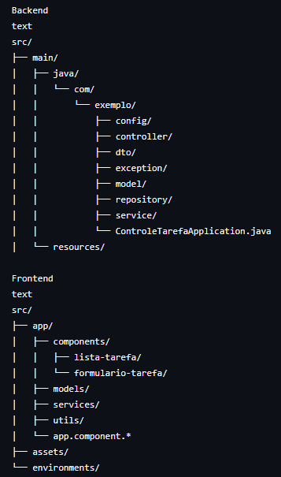

# Sistema de Gerenciamento de Tarefas


Sistema completo para gerenciamento de tarefas com frontend em Angular e backend em Spring Boot.

## Sumário

- Visão Geral
- Funcionalidades
- Tecnologias
- Instalação
  - Backend
  - Frontend
- Documentação da API
- Endpoints
- Estrutura do Projeto
- Contribuição
- Licença

## Visão Geral

Este projeto consiste em um sistema completo para gerenciamento de tarefas com:

- **Frontend**: Aplicação Angular 20 com Material UI
- **Backend**: API RESTful com Spring Boot 3.1

## Funcionalidades

✅ Listagem paginada de tarefas com filtros  
✅ Cadastro e edição de tarefas  
✅ Alteração de status (Concluir/Pendente)  
✅ Validação de formulários  
✅ Ordenação por colunas  
✅ Responsividade  

## Tecnologias

### Frontend
- Angular 20
- Angular Material
- RxJS
- TypeScript
- HTML5/SCSS

### Backend
- Spring Boot 3.1
- Spring Data JPA
- Hibernate
- Lombok
- MapStruct
- H2 Database (dev)
- OpenAPI 3 (Swagger)

## Instalação

### Backend

1. Clone o repositório:
```bash
git clone https://github.com/seu-usuario/tarefas-backend.git
cd tarefas-backend
```

2. Configure o banco de dados (application.properties):

3. Execute a aplicação:
```bash
./mvnw spring-boot:run
Frontend
```

4. Acesse o diretório do frontend:
```bash
cd tarefas-frontend
```

5. Instale as dependências:

```bash
npm install
```

6. Inicie a aplicação:

```bash
ng serve
Acesse: http://localhost:4200
```

### Documentação da API
A documentação completa da API está disponível via Swagger:

📚 Swagger UI: http://localhost:8080/swagger-ui.html
📝 OpenAPI: http://localhost:8080/v3/api-docs

### Endpoints Principais

Método	Endpoint	Descrição
GET	/tarefas	Lista tarefas com paginação
POST	/tarefas	Cria nova tarefa
GET	/tarefas/{id}	Obtém tarefa por ID
PUT	/tarefas/{id}	Atualiza tarefa
DELETE	/tarefas/{id}	Remove tarefa
PATCH	/tarefas/{id}/concluir	Marca tarefa como concluída
PATCH	/tarefas/{id}/pendente	Marca tarefa como pendente

### Estrutura do Projeto


